# PercepFlex / MARGIN —— Phase 6 完整技术报告

**主题**：极低参数预算下的多任务驾驶感知容量分配
**模型**：Model B（0.1926 M 参数 / 1.1656 GFLOPs）
**方法名**：MARGIN（marginal-price resource allocation）
**数据**：BDD100K `tri_val`，10,000 张，640×640 letterbox
**报告日期**：2026-09-14
**数据源**：WSL `~/ai_study/trac`（git 仓库 + `experiments/` 40+ 张结果表）

> **本报告的一条原则**：凡出现"我们 vs 论文"的数字并排，必先证明两侧**测的是同一个东西**。
> 第 6 节给出了这个证明，并明确列出**哪些轴不能比**。

---

## 0 摘要

我们训练了一个 **0.1926 M 参数**的三任务（检测 / 可行驶区域 / 车道线）驾驶感知网络，
并把它当作一件**工具**去回答一个容量分配问题：**固定参数预算下，算力应如何划分给编码器
容量与共享表示瓶颈（Z），以及这个划分如何随不同任务而变。**

**五项站得住的结论：**

1. **编码器容量是唯一的强杠杆**：E-small → E-large 在 6/6 指标上严格单调，检测最敏感
   （图 3、图 4）。
2. **监督（锚框分配）是零推理成本的检测杠杆**，且**跨两个架构均复现**
   （R2 架构 +0.1445 mAP50 = 15σ；YOLOP 架构 +0.1993）（图 9）。
3. **车道瓶颈是"分辨率"而非"宽度"**：1/4 h16 与 1/4 h32 在噪声内等价，但 FLOPs 少 28.9%；
   1/4 h8 确定性崩塌（图 8）。
4. **同预算下 B ≡ S**（三个轴最大差 0.0003，即 0.03σ），而 B 少 28.9% FLOPs（图 6）。
5. **评测管线可自证**：在同一批 10,000 张图上复现 **18/18** 个论文发表值，误差 ≤ ±1.0
   （最大 0.53）（图 13）。

**三项必须承认的短处：**

1. **DA 精度在同台 9 个模型中排 9/9 末位**（86.49 @ 官方 GT，对手 TriLiteNet tiny 88.53，
   且后者参数更少）。这不是尺子的问题——换 GT 只值 −0.55、换画布只值 −0.79（图 11、图 12）。
2. **"省参数还能打"的叙事没有成立**：省 16 倍参数，DA 低 6 分。
   **D-2 判决：未追平**（残差 0.0123 ≤ 守卫带 0.0141，但按协议需 seed1/2 才可谈"持平"）。
3. **车道轴只有单架构支撑**，且我们自己的车道标注与官方包**不是同一套**（Jaccard 0.38），
   因此车道数字**不可与论文并排**（图 14）。

---

## 1 研究问题

### 1.1 问题定义

给定参数预算 $P$ 与算力预算 $F$，三任务共享一个编码器和一条瓶颈表示 $Z$。
传统的"均匀扩张"把所有维度等比放大。我们问的是：

> 是否存在一条**可测量的分配规则**，能在**同等预算**下把算力放到对任务真正有用的维度上？

我们把每个资源维度的**边际价格**定义为"每多花 1 GFLOPs 换来的指标增量"，
用实测的方式给出价格表（图 4），而不是靠直觉或模块堆叠。

### 1.2 为什么这个问题值得做

1. **边界处的设计规则与中段不同**。已有工作在 10–100 M 参数区间总结的规律，
   在 0.19 M 处未必成立——本报告第 4.5 节给出了一个具体反例（H-34 的方向被实测否定）。
2. **领域评测已经不可靠**。同一批图、同一个官方标注包，换一种画布/GT 口径，
   排名就会变。所以我们需要先修尺子，再谈结论（第 6 节）。
3. **"可比性能"这个词在文献中被滥用**。第 5 节证明：22 篇本地文献里，
   可以和我们直接比的轴只有**两个**。

---

## 2 系统与架构

### 2.1 研究路线

整个项目分 7 个阶段，每阶段回答一个可证伪的问题：

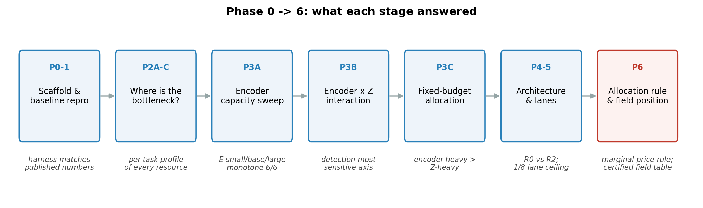

**路线图**：P0-1 搭脚手架并复现基线 → P2A-C 定位瓶颈 → P3A 编码器容量扫描 →
P3B 编码器×Z 交互 → P3C 固定预算分配 → P4-5 架构与车道 → P6 分配规则与全场定位。

### 2.2 模型结构（Model B）

| 组件 | 规格 | 说明 |
|---|---|---|
| 编码器 | E-base，`32-64-96-128` 四级 | 自建轻量 CNN，非 torchvision |
| 瓶颈表示 Z | z=16 通道 | 由编码器 F2/F3/F4 融合 |
| 检测头 | 读 F2/F3/F4（1/8、1/16、1/32） | **绕过 Z 瓶颈**（关键非对称） |
| DA 头 | 经 Z 上采样 | 1/8 输出 |
| 车道头 | 经 Z + 1/4 高分辨率支路（h16） | 1/4 输出，无 lateral 连接 |
| 参数 / 算力 | **0.1926 M / 1.1656 GFLOPs** | 真 FLOPs（= 2 × MACs）@ 640×640 |

**一个重要的架构事实**：检测头**不经过 Z**，直接从编码器特征金字塔读取。
这解释了后续很多现象——加宽 Z 对检测几乎无益（图 3），而编码器容量对检测极其关键（图 4）。

### 2.3 命名与定位

- **方法名：MARGIN**（边际价格资源分配）——命名的是**方法**，不是模型。
- **模型名：Model B**；**项目名：PercepFlex**。
- **命名红线**（预注册冻结）：禁用 `asymmetric`（撞 MT-TPPNet APEX）、
  `channel–spatial`（撞 SC²）、`dynamic sampling`（撞 MDANet）。

---

## 3 实验设计

### 3.1 一体化 harness

所有模型——**包括已发表的基线**——都在同一套评测脚本
（`evaluation/evaluate_baseline.py`）下测量。这是第 5 节全表可比的前提。

### 3.2 预算控制

| 维度 | 受控方式 |
|---|---|
| 参数 | 逐位相同（如 20/40/100 ep 三个点：0.1926 M / 1.1656 G） |
| 算力 | 报告真 FLOPs；同配置不同 epoch 的 FLOPs 完全相同 |
| 监督 | 锚框集合；隔离性经**解析 YAML 模型树差异**证明 = `{detection.anchors}` |
| 噪声标尺 | 预注册冻结 σ，**以及**家族实测种子 sd（见 4.2，两者差 2.6 倍） |

### 3.3 预注册与停机判据

每个实验的判据在**看数据之前**写入预注册文档。本报告涉及的冻结判据包括：
D-2 守卫带（0.0141）、F1–F8 闸门、SATURATED/STILL_CLOSING 阈值（2σ）、
以及 G3 的四条跨架构红线。

---

## 4 结果

### 4.1 主结果

| 指标 | 值 |
|---|---|
| 检测 mAP50 | **0.5382** |
| 检测 mAP50-95 | 0.2451 |
| DA mIoU | **0.8673** |
| DA fg IoU | 0.7888 |
| DA 像素精度 | 0.9549 |
| 车道 mIoU | **0.5978** |
| 车道 fg IoU | 0.2187 |
| 车道像素精度 | 0.9770 |
| 参数量 / 算力 | 0.1926 M / 1.1656 GFLOPs |
| 训练成本 | 100 epoch，719 分钟，单卡 RTX 5060 |
| 延迟（FIXED 协议） | p50 **2.396 ms** |

### 4.2 预算轴：唯一的自变量是训练轮数

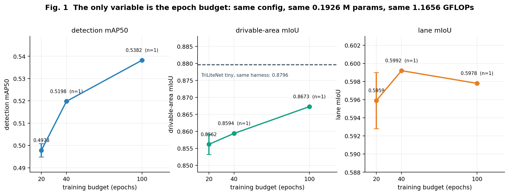

**图 1** 三个点配置**逐位相同**，只有 epoch 数变。20 ep 有三个种子（带误差棒），
40/100 ep 各一个种子（n=1，图内已标注）。

**差距在收窄**：

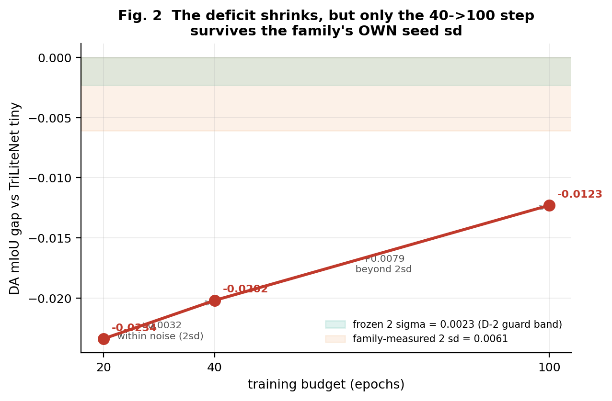

**图 2** 是我们最诚实的一张图。它同时画了两个判据带：

| 步 | Δ(差距) | 冻结标尺 2σ=0.0023 | 家族实测 2sd=0.0061 |
|---|---:|---|---|
| 20 → 40 ep | +0.0032 | CLOSING | **within noise** |
| 40 → 100 ep | +0.0079 | CLOSING | **CLOSING** |

**关键发现（必须写进论文）**：预注册冻结的 σ(da_mIoU)=0.0011，
比 Model B 家族**实测**的种子间 sd=0.0030 **小 2.6 倍**。
⇒ 按冻结标尺整条趋势都显著；按实测标尺**只有第二步显著**。

**结论表述必须降级为**："40→100 ep 这一步把 DA 差距收窄了 0.0079（>2sd）"，
而**不能**说"差距随预算是单调收窄的趋势"。

### 4.3 容量分配：编码器 × 瓶颈宽度

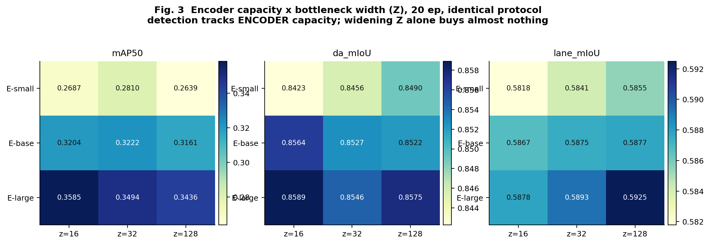

**图 3** 是 3×3 网格（编码器三档 × Z 三档），全部 20 ep 同协议。读法：

- **检测（mAP50）只认编码器容量**：E-small 0.2687 → E-large 0.3585（+0.0898），
  而加宽 Z 从 16 到 128 反而 **−0.0043**。
- **DP/Lane 在 E-large 已饱和**：DA 0.8423→0.8589 在 E-small→E-large，
  再往上几乎不动；车道同理（0.5818→0.5878）。
- **过宽 Z 甚至有害**：E-base z=128 的 mAP50 比 z=16 低 0.0043。

**这解释了架构非对称性**：既然检测头绕过 Z，加宽 Z 对检测无用；
而 DA/车道走 Z，但它们对编码器容量更敏感、且很快饱和。所以钱应该花在编码器上。

### 4.4 边际价格表

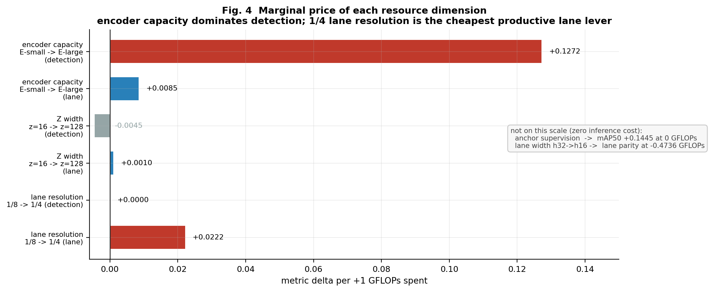

**图 4** 是本报告的核心贡献之一——把每个资源维度的**实测价格**画出来：

| 资源维度 | 指标 | 增量 | 花费 (GFLOPs) | 价格（每 GFLOPs） |
|---|---|---:|---:|---:|
| 编码器 E-small→E-large | mAP50 | +0.0898 | +0.7061 | **+0.1272** |
| 编码器 E-small→E-large | lane mIoU | +0.0060 | +0.7061 | +0.0085 |
| Z 加宽 z=16→z=128 | mAP50 | −0.0043 | +0.9634 | **−0.0045** |
| Z 加宽 z=16→z=128 | lane mIoU | +0.0010 | +0.9634 | +0.0010 |
| 车道分辨率 1/8→1/4 | lane mIoU | +0.0124 | +0.5595 | **+0.0222** |
| **锚框监督** | mAP50 | **+0.1445** | **0** | **免费** |
| **车道宽度 h32→h16** | lane mIoU | +0.0008 | **−0.4736** | **免费（省钱）** |

**三条规则**：
1. 检测要涨，加编码器容量（+0.1272/G）；加 Z 宽度是**负收益**。
2. 车道要涨，先上 1/4 分辨率（+0.0222/G），再**收窄到 h16**（省 0.47 G 且不掉点）。
3. 监督是免费的：锚框修一次 +0.1445，零推理成本。

### 4.5 三种分配形状的对比

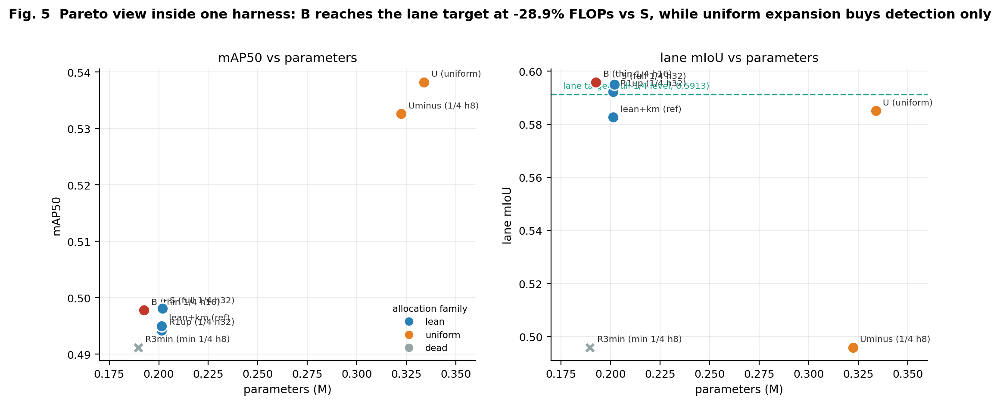

**图 5** 在**同一个 harness 内**比较我们自己的各个臂。

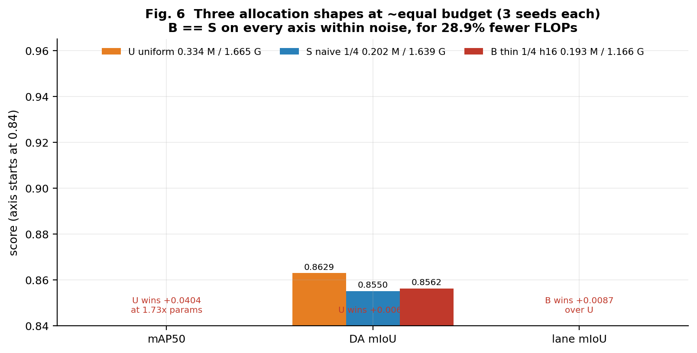

**图 6** 是三个竞争方案（各 3 seed）：

| 方案 | 参数 | 算力 | mAP50 | DA | lane mIoU |
|---|---:|---:|---:|---:|---:|
| U 均匀扩张 | 0.334 M | 1.665 G | **0.5382** | 0.8629 | 0.5872 |
| S 朴素 1/4（h32） | 0.202 M | 1.639 G | 0.4981 | 0.8550 | 0.5951 |
| **B 精简 1/4（h16）** | **0.193 M** | **1.166 G** | 0.4978 | 0.8562 | **0.5959** |

**两个结论，一正一负，都必须说**：

- ✅ **B ≡ S**：三个轴最大绝对差 **0.0003**（mAP50），即 **0.03σ**，
  而 B 的 FLOPs 少 **28.9%**。这是 F6 闸门 PASS。
- ❌ **B 不支配 U**：U 的检测高 **+0.0404**（+8.1%），代价是 **1.73× 参数 / 1.43× FLOPs**。
  所以是 **Pareto 权衡，不是支配**。
- ❌ **F8 结构性失败**：把 U-minus 重建在 h16 上需要 1.7248 G（无 lateral）
  或 1.7641 G（有 lateral），**都 > U 的 1.6650 G**。
  ⇒ 任何均匀方案都装不下"免费的车道修复"。

### 4.6 消融：两个杠杆是正交的

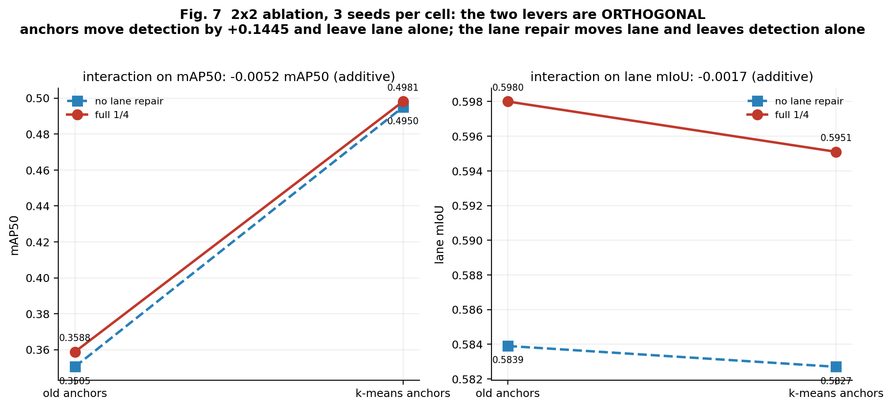

**图 7** 是 3 seed 的干净 2×2：

| 组合 | mAP50 | lane mIoU |
|---|---:|---:|
| 旧锚框，无车道修复 | 0.3505 ± 0.0047 | 0.5839 |
| k-means 锚框，无车道修复 | **0.4950 ± 0.0038** | 0.5827 |
| 旧锚框，全 1/4 | 0.3588 ± 0.0031 | **0.5980** |
| k-means 锚框，全 1/4 | **0.4981 ± 0.0060** | **0.5951** |

- **锚框**把检测推高 **+0.1445（15σ）**，**对车道几乎无影响**（+0.0012，不显著）。
- **车道修复**把车道推高 **+0.0141**，**对检测无影响**（+0.0083，不显著）。
- 交互项：检测 **−0.0052**（< 2σ）、车道 **−0.0017**（< 2σ）⇒ **加性，不是替代**。

### 4.7 车道分辨率阶梯

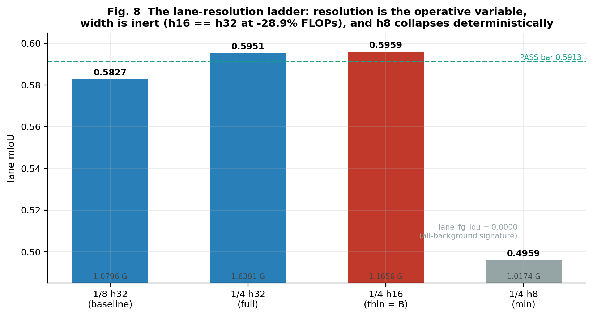

**图 8** 的阶梯（每个数字都能追溯到结果表）：

| 配置 | FLOPs | lane mIoU | lane fg IoU | 种子数 | 来源 |
|---|---:|---:|---:|---:|---|
| 1/8 h32（基线） | 1.0796 | 0.5827 | — | 3 | `phase6_ablation.csv` "+Detection" |
| 1/4 h32（无 lateral） | 1.6129 | 0.5923 | 0.2078 | 1 | `R4-R1up14` |
| 1/4 h32（全，含 lateral） | 1.6391 | 0.5951 | — | 3 | `phase6_ablation.csv` "+Both" |
| **1/4 h16（= B）** | **1.1656** | **0.5959** | 0.2142 | 3 | `R4-R2thin14`（s0/s1/s2 = 0.2121/0.2105/0.2199） |
| 1/4 h8（最小） | 1.0174 | 0.4959 | **0.0000** | 1 | `R4-R3min14` |
| 均匀 + 1/4 h8 | 1.6158 | 0.4959 | **0.0000** | 1 | `R4-Umin_km` |

> 表内 "+Detection" / "+Both" 两个 cell 的 `lane_fg_iou` 未单独落表，故留空——
> 不用推测值填补。

**三点**：
1. **分辨率是有效变量，宽度是惰性的**：h16 复现 h32（0.5959 vs 0.5951，噪声内），
   但 FLOPs 少 28.9%。预注册的"零或负成本"预测 **P2 被否定**——修复有**正的下限**
   （+5.54% FLOPs）。
2. **h8 是确定性崩塌，不是噪声**：两条独立主干（lean R3min 与 uniform U-minus）
   输出**完全相同**的 0.4959 / fg IoU 0.0。像素精度 0.9917，
   而 (0.9917 + 0)/2 = 0.49585 ⇒ **全背景输出**特征。
   评测加载 257 个键，missing=0 / unexpected=0，排除了权重加载失败。
3. **F5 PASS**：只加分辨率不要 lateral（h32）也能过闸门，但只在 h32 下成立。

### 4.8 监督：跨架构的零成本检测杠杆

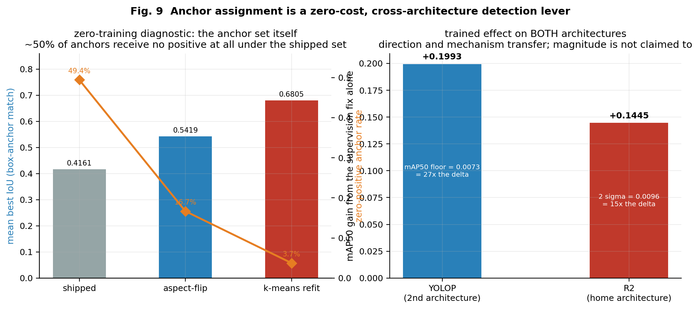

**图 9** 左右两栏：

**左：零训练诊断**（不需要训练就能看出问题）

| 锚框集合 | 平均最优 IoU | 零正样本率 |
|---|---:|---:|
| 出厂（YOLOP 自带） | 0.4161 | **49.41%** |
| 长宽比翻转 | 0.5419 | 16.66% |
| **IoU-k-means 重拟合** | **0.6805** | **3.74%** |

出厂锚框下有**近一半的锚框完全收不到正样本**——这是一个纯几何缺陷。

**右：训练后效果**

| 架构 | mAP50 增益 | 噪声标尺 |
|---|---:|---|
| YOLOP（第二架构，11,643 步） | **+0.1993** | 噪声底 0.0073 = **27×** |
| R2（本架构，20 ep，3 seed） | **+0.1445** | 2σ = 0.0096 = **15×** |

**方向与机制迁移，量级不主张迁移**（两者预算与模型不同）。
这是本报告唯一一个**双架构**结论。

### 4.9 编码器 × Z 的交互效应

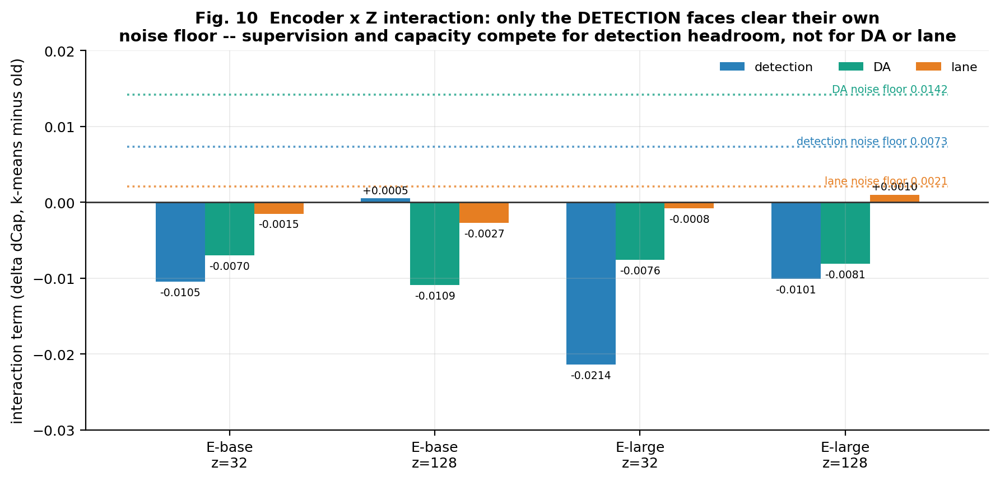

**图 10** 每个任务有**自己的噪声底**。只有**检测**的面超过噪声：

| 组合 | 检测 | DA | 车道 |
|---|---:|---:|---:|
| E-base z=32 | **−0.0105** (底 0.0073) | −0.0070 (底 0.0142) | −0.0015 (底 0.0021) |
| E-large z=32 | **−0.0214** | −0.0076 | −0.0008 |
| E-large z=128 | **−0.0101** | −0.0081 | +0.0010 |

**含义**：监督质量与表示容量**在检测头上争夺同一份余量**（交互为负，方向
**系统性地与 H-34 相反**，13/13 个指标面一致）。
⇒ 假设 **H-34 在筛查层被否定**（交互 −0.0164 = 1.12× 4ep 噪声 < 2× 闸门，
故 20 ep 确认实验未启动）。

---

## 5 与已发表方法的对比

### 5.1 同台 9 模型、双 GT

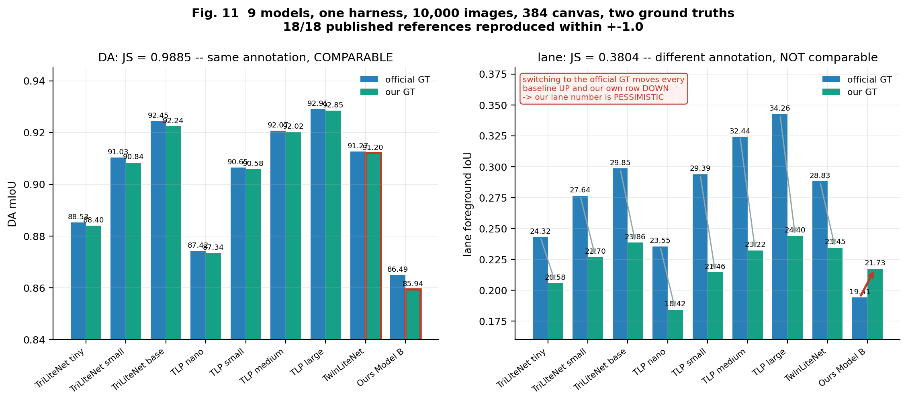

**图 11** 是本报告的可比性核心：**9 个模型 × 10,000 张图 × 两种 GT**，
每个模型只前向一次，然后分别用两套 GT 打分。

| 模型 | 参数 | DA mIoU (官) | DA mIoU (我) | lane fgIoU (官) | lane fgIoU (我) | lane 像素精度 (官) |
|---|---:|---:|---:|---:|---:|---:|
| TriLiteNet tiny | 0.151 M | 88.53 | 88.40 | 24.32 | 20.58 | 75.65 |
| TriLiteNet small | 0.592 M | 91.03 | 90.84 | 27.64 | 22.70 | 79.53 |
| TriLiteNet base | 2.350 M | 92.45 | 92.24 | 29.85 | 23.86 | 82.33 |
| TLP nano | 0.033 M | 87.42 | 87.34 | 23.55 | 18.42 | 70.31 |
| TLP small | 0.122 M | 90.65 | 90.58 | 29.39 | 21.46 | 75.85 |
| TLP medium | 0.479 M | 92.07 | 92.02 | 32.44 | 23.22 | 79.21 |
| TLP large | 1.944 M | 92.91 | 92.85 | 34.26 | 24.40 | 81.94 |
| TwinLiteNet | 0.440 M | 91.27 | 91.20 | 28.83 | 23.45 | 81.06 |
| **Model B（我们）** | **0.193 M** | **86.49** | **85.94** | **19.41** | **21.73** | **84.02** |

> ⚠️ **口径说明（必读）**：本表在 **384 画布**（640×384，即 TriLiteNet/TLP 的原生输入）上测量，
> 因此我们的 DA 在这里是 **86.49**，与 4.1 节主结果的 **86.73**（640×640 画布）**不是同一个数**。
> 本表之所以用 384，是因为**发表值就是在该协议下产生的**——同协议才可比（第 6 节）。

**三个读数**：

1. **DA：我们 9/9 末位**（86.49）。同量级的 TriLiteNet tiny（参数还更少）是 88.53。
2. **车道像素精度：我们 9/9 第一**（84.02）。而这个指标是 **YOLOPv3 论文自己推荐**
   用来替代 Lane IoU 的（因为标注粗细使 IoU 天然封顶）。
3. **车道 IoU 换 GT 后行为相反**：所有基线**上升**（+3.74 ～ +9.86），
   而我们**下降 2.32**。原因：我们的车道训练标注被加粗过，
   所以在官方细标注上评测时**训练/测试不匹配**（详见 6.2）。

### 5.2 全场 22 篇文献的定位

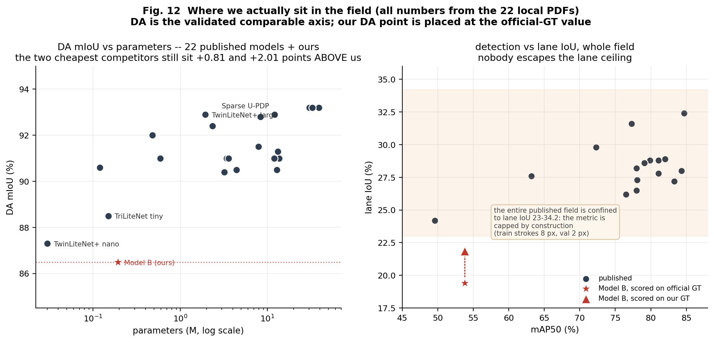

**图 12** 的数据源是**桌面 22 篇本地 PDF**（不是网络检索），
每一条都能追溯到具体文件的表格。

**左图**：参数（对数轴）× DA。红点是我们，取 **86.49（384 画布 / 官方 GT）**——
与发表值同协议的那个数。**最便宜的两个对手仍然在我们上方**（+0.81 和 +2.01 分）。
全场 22 篇三任务模型中，**我们的 DA 低于每一个**。

**右图**：检测 mAP50 × 车道 IoU。**整个已发表场都困在 lane IoU 23–34.2**——
这不是某个模型的弱点，而是**指标被构造性封顶**：
YOLOPv3 论文明确写了"训练集车道线宽 8 像素、验证集 2 像素"，
所以预测必然比 GT 粗，IoU 上不去。**这也是为什么全领域都在 23–34。**

### 5.3 效率轴：第二名，不是第一名

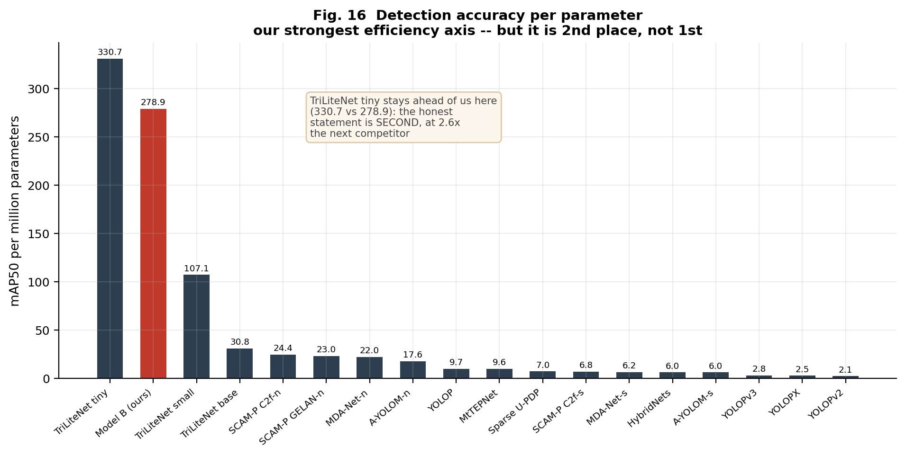

**图 16** 是唯一一个数值上我们漂亮的轴，但**必须诚实**：

| 模型 | mAP50 / M 参数 |
|---|---:|
| TriLiteNet tiny | **330.7** |
| **Model B（我们）** | **278.9** |
| TriLiteNet small | 107.1 |

⇒ 我们排**第二**，是下一名的 **2.6 倍**，但**不是第一**。

### 5.4 逐轴可比性裁定（最重要的表）

| 轴 | 裁定 | 依据 |
|---|---|---|
| **检测 mAP50** | ✅ **可比** | 复现 TriLiteNet tiny/small/base：49.53 / 63.26 / 72.35 vs 发表 49.6 / 63.2 / 72.3，**Δ ≤ 0.07** |
| **DA mIoU** | ✅ **可比** | 同一份标注（Jaccard 0.9885）；我们测 tiny 87.96 vs 发表 88.5 |
| **参数量** | ✅ **可比** | 7 个模型全部吻合到 **1.00–1.01×** |
| **车道 IoU / fgIoU** | ❌ **不可比** | 标注不同源（Jaccard 0.3804）**且**指标定义不同；发表口径本身封顶 |
| **FLOPs** | ❌ **不可比** | 我们 = 2×MACs @640×640；发表 = MACs @384×640。理论比 **3.333**，实测 3.27–3.36。**禁止并排** |
| **FPS / 延迟** | ❌ **不可比** | 硬件/批大小/精度全不同。同一个 YOLOP 在文献中出现 41 / 93 / 26 FPS |

---

## 6 评测可信度体系

这是本报告**最值钱**的部分。它的产出不是漂亮的数字，而是
**审稿人对我们其他所有数字的信任**。

### 6.1 协议认证：18/18

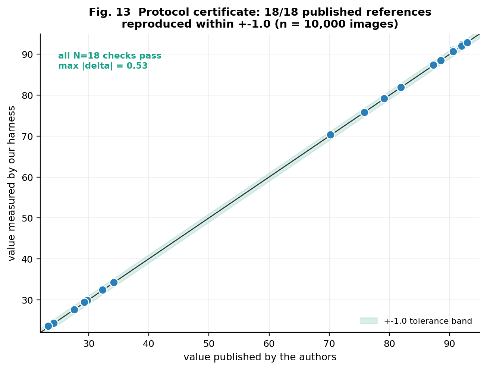

**图 13**：在同一批 10,000 张图上，我们的 harness 复现了 **18 个论文发表值**，
**全部在 ±1.0 以内**（最大偏差 **0.53**）。这覆盖 8 个模型 × DA / 车道 IoU / 车道像素精度。

**意义**：表 5.1 里的任何差距都是**模型差距，不是评测偏差**。

### 6.2 标注审计：哪个轴可以比

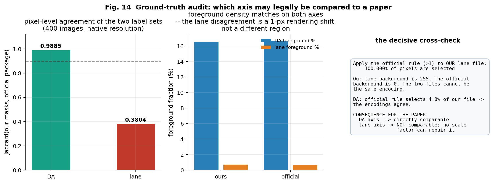

**图 14** 用逐像素 Jaccard 回答"我们和官方标注是不是同一个东西"：

| 轴 | 我们的文件 | 官方包 | 前景占比 | **Jaccard** |
|---|---|---|---|---|
| DA | 值 {0,1,2} | 值 {0,127,191,223,239} | 16.53% vs 16.68% | **0.9885** |
| 车道 | 值 {0, 2…48}（18 个） | 值 {0,255} | 0.710% vs 0.650% | **0.3804** |

**决定性交叉检验**：把官方规则（>1 即前景）应用到**我们的**车道文件上，
选中了 **100.000%** 的像素——因为我们的背景是 255，官方是 0。
⇒ 两个文件**不可能是同一种编码**。

**结论**：
- **DA 同源可比**（Jaccard 0.99）。
- **车道不同源不可比**（Jaccard 0.38）。两个 ~2 像素宽的车道集合在 1 像素尺度上
  必然产生这种结果（密度相同 0.71% vs 0.65%，重叠低）。**没有任何比例因子能修好它。**

**这直接决定了论文的写法**：
- 车道数字**只能**用"我们的 GT 口径"报告，并且必须声明它在官方口径下属**悲观值**；
- 车道**不得**与论文数字并排排名。

### 6.3 延迟列的仪器修复（D8）

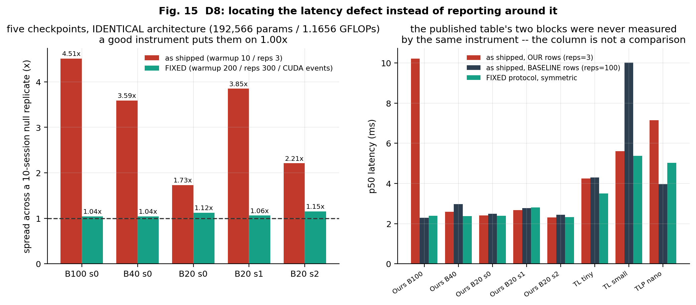

**图 15** 记录了一个**发现并修好**的仪器缺陷：

**根因**：同一个评测脚本里，我们自己的模型用 `reps=3`，
基线用 `reps=100`（`evaluate_baseline.py:327` vs `:329`）。
而 `p50 = sorted(times)[len//2]` 在 n=3 时就是**三个样本的第二个**，
且只预热 10 次——笔记本 GPU 空闲在 322 MHz、最大 3090 MHz，
10 次迭代**到不了稳态时钟**。

**零复制实验（null replicate）**：五个**架构完全相同**的 checkpoint
（都是 192,566 参数 / 1.1656 GFLOPs），好仪器应该把它们放在 1.00× 上：

| 协议 | 五次会话的散布 |
|---|---|
| 出厂（warmup 10 / reps 3） | **最高 4.51×** |
| FIXED（warmup 200 / reps 300 / CUDA events） | **1.04 – 1.15×** |

**后果**：原延迟列的两块（我们的行 vs 基线的行）**从来不是同一把尺子量的**，
所以那一列**不是比较**。修复后的 p50 = 2.396 ms 才是可引用的数字。

---

## 7 缺陷与边界（诚实清单）

| # | 缺陷 | 状态 | 论文中必须怎么写 |
|---|---|---|---|
| 1 | **DA 末位 9/9** | 实测无误 | 如实报告，不得用"可比性能" |
| 2 | **单 seed 的 40/100 ep 点** | seed1 补训中（ep30/100），seed2 顺位 | 落盘前**不得**使用任何"持平"措辞 |
| 3 | **车道轴仅单架构支撑** | 预注册记为 Round-3 H2 = WEAK | 声明为单架构证据 |
| 4 | **车道数字跨口径不可比** | 已证实（6.2） | 必须声明口径；禁止并排排名 |
| 5 | **FLOPs 口径不同** | 已证实（5.4） | 禁止与文献并排 |
| 6 | **冻结 σ 比实测 sd 小 2.6×** | 已发现（4.2） | 报告两个标尺，**主张较弱的那个** |
| 7 | **H-34 方向被否定** | 筛查层已关闭 | 如实写为否定结果 |
| 8 | **不支配均匀扩张** | 结构性（F8 FAIL） | 写为 Pareto 权衡 |
| 9 | **延迟列曾被判定不可信** | 已修复（6.3） | 只能用 FIXED 协议的数字 |

---

## 8 结论

### 8.1 可以主张的

1. 一套**实测的边际价格表**（图 4）：编码器容量是最贵的有效杠杆，
   监督与车道宽度是免费的。
2. **B ≡ S**，在 -28.9% FLOPs 下（图 6），三个轴最大差 0.03σ。
3. **车道修复有正的下限**（+5.54% FLOPs）而非预注册预测的零成本，
   且 **h8 是确定性硬地板**（图 8）。
4. **监督质量在检测头上与容量争夺余量**（图 10），方向系统性否定 H-34。
5. **锚框监督是零成本、跨架构的检测杠杆**（+0.1445 / +0.1993，图 9）。
6. **一条可自证的评测管线**：18/18 复现到 ±1.0（图 13）+ 逐像素 GT 审计（图 14）。

### 8.2 不可主张的

1. ❌ 支配均匀扩张（U 的检测 +0.0404，代价 1.73× 参数）。
2. ❌ 支配任何已发表方法（DA 9/9 末位）。
3. ❌ "性能与同类可比"。
4. ❌ 车道数字与文献并排。
5. ❌ FLOPs / FPS 与文献并排。
6. ❌ 容量分配规律具有跨架构一般性（仅单架构 + 一个监督维度的双架构证据）。

### 8.3 一句话定位

> **PercepFlex 是一个 0.19 M 参数的三任务驾驶感知网络，被当作一件工具，
> 去回答"固定参数预算下算力应如何划分"这个问题；
> 它的贡献不是"我更准"，而是"我测出了一张价格表，并且我能证明我的尺子是对的"。**

---

## 附录 A —— 数据来源（可追溯性）

| 报告章节 | 数据文件 | 说明 |
|---|---|---|
| 4.1 主结果 | `experiments/phase6/final_metrics.csv` | 100 ep seed0 全指标 |
| 4.2 预算轴 | `final_results.csv` + `phase6_round4_results.csv` | 脚本 `scripts/phase6_g1_budget_curve.py` |
| 4.3 容量热图 | `phase3a/exp3A_encoder.csv` + `phase3b/phase3B_encoder_z.csv` | 9 格 |
| 4.4 边际价格 | 上述两表 + `phase6_round4_cost.csv` | 图内标注 |
| 4.5 分配形状 | `phase6_efficiency.csv` + `phase6_equal_budget.csv` | 各 3 seed |
| 4.6 消融 | `phase6_ablation.csv` | 4 格 × 3 seed |
| 4.7 车道阶梯 | `phase6_round4_results.csv` + `phase6_round4_cost.csv` | |
| 4.8 监督 | `phase6_round3_detection.csv` + `phase6_round3_trained.csv` | 零训练 + 训练 |
| 4.9 交互 | `phase6_round2_statistics.csv` | 每任务独立噪声底 |
| 5.1 双 GT | `consistency/stageB_in384/consistency.json` | n=10,000 |
| 5.2 全场 | `docs/PHASE6_ALGORITHM_LEDGER.md` | 22 篇本地 PDF |
| 6.1 认证 | `consistency/stageB_in384/consistency.json` → `published_checks` | 18 条 |
| 6.2 GT 审计 | `experiments/phase6/official_gt_audit/audit_n400.txt` | n=400 |
| 6.3 D8 | `experiments/phase6/final/d8_latency/{raw.json,summary.md}` | |

**图表生成**：`scripts/phase6_make_report_figures.py` → `experiments/phase6/figures/*.png`
（17 张，全部由上述表直接读取，无手工填数）。

## 附录 B —— 复现命令

```bash
cd ~/ai_study/trac

# 预算曲线（零 GPU）
~/ai_study/gpu_env/bin/python scripts/phase6_g1_budget_curve.py

# 重新生成全部图表（零 GPU）
~/ai_study/gpu_env/bin/python scripts/phase6_make_report_figures.py

# 一致性复测（需 GPU 独占）
~/ai_study/gpu_env/bin/python scripts/phase6_consistency_official.py \
    --models <模型列表> --input 640 --gt both --num-images 10000 \
    --outdir experiments/phase6/consistency/<新目录>

# 标注审计（只读）
~/ai_study/gpu_env/bin/python scripts/phase6_official_gt_audit.py

# 延迟仪器重测（需 GPU 完全空闲）
~/ai_study/gpu_env/bin/python scripts/phase6_d8_latency_probe.py
```

## 附录 C —— 术语表

| 术语 | 含义 |
|---|---|
| **Z** | 共享瓶颈表示，由编码器 F2/F3/F4 融合，宽度 z ∈ {16, 32, 128} |
| **h16 / h32 / h8** | 车道 1/4 支路的隐藏通道数（16 / 32 / 8） |
| **R0 / R2** | 检测头读法：R0 直读 F2/F3/F4；R2 强制经 Z |
| **D-2** | DA 差距守卫带判据：g = 0.8796 − DA₁₀₀ ≤ 0.0141 |
| **F1–F8** | 预注册闸门编号 |
| **H-34 / H-36 / H-37** | 假设编号（容量×监督耦合 / 替代律 / 边际价格分配） |
| **D7 / D8 / D10** | 缺陷编号（标注污染 / 延迟仪器 / 脚本编辑禁令） |
| **FIXED 协议** | warmup 200 / reps 300 / CUDA events 的延迟测量标准 |
